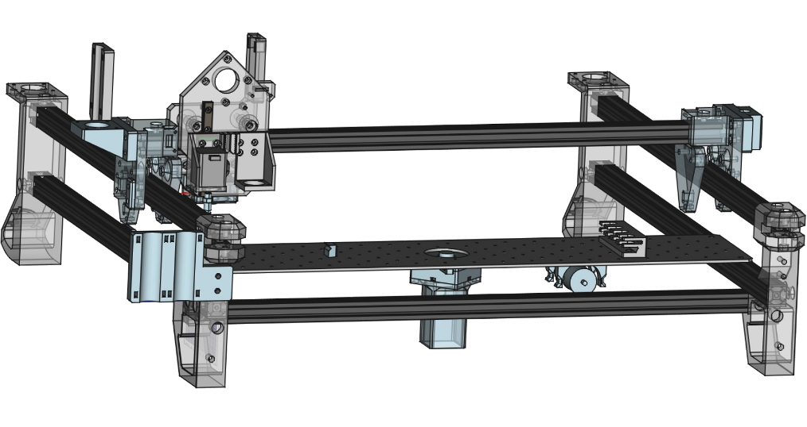

# Index PnP
The Index Pick and Place is an open source pick and place machine to aid in [Mid-Scale Manufacturing](http://stephenhawes.com/level-2-manufacturing/). 

This project is **under development**. It is not currently in a stable state. Development is active and ongoing, but this is not yet a finished design. If you'd like to build one to help find bugs and design issues, please do!

The Index is designed to be low-cost enough that someone could buy or build one to support making production runs at home or as a small business. It runs using OpenPnP. The Index will eventually be able to do multiple parts of the PCBA manufacturing process. It is currently capable of picking parts and placing them, but eventually the Index will support solder paste dispensing and interfacing with other machines, such as a PCB panel hopper and reflow oven. 

Along with the Index machine itself, the project also includes feeders designed to work with the Index. Although they were designed with the Index in mind, they can work with any OpenPnP pick and place with a 20mm x 20mm rail for mounting.

The Index's development process is being catalogued in a series of videos. A play list of these can be found [here](https://www.youtube.com/playlist?list=PLIeJXmcg1baLBz3x0nCDqkYpKs2IWGHk4).

## System Overview
The Index is controlled with [OpenPnP](https://github.com/openpnp/openpnp). OpenPnP generates [GCODE](https://en.wikipedia.org/wiki/G-code) based on PCB design files and sends it over to a custom motherboard running a modified version of Marlin. This handles controlling the motors, pump, limit switches, feeders, etc.

The motherboard communicates with the feeders over RS-485. After the feeder receives a command from the motherboard, it sends a confirmation or error message back. This is then sent back to OpenPnP. Situations where the feeder would send an error message back would be a tape run out or jam. 

## Documentation
Documentation is currently hosted [here](https://docs.indexmachines.io/docs/), it's still a work in progress with some preliminary build instructions and contributions are welcome.

## Contributing
If you would like to contribute to the project, awesome! Check out the [contributing page](CONTRIBUTING.md) to get started.

## Building an Index
This is an unfinished design. Builds at this time should be thought of as helping the R&D process, and not for the end result of having a fully operational pick and place.

### Ordering PCBs
Many boards in the design are also used in a mechanical way, meaning some specifics of how the boards are ordered matters more than usual.

#### Default Configuration
- Board Thickness: 1.6mm
- Pad Plating: Any
- Silk/Mask: Any

#### Feeder Indexing Wheel Configuration
- Board Thickness: 1mm
- Pad Plating: Any
- Silk/Mask: Any

### 3D Printing
During development of the Index, all parts were printed in PLA. A few parts in particular require quite a high strength if being printed. 

Details of 3D printer/slicer settings can be found [here](https://docs.indexmachines.io/docs/reference/print-settings/).

Images of the various 3D printed parts are [here](https://docs.indexmachines.io/docs/reference/fdm/).
